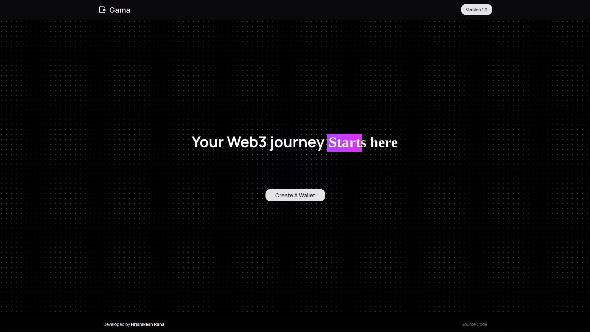

## Gama

A modern web-based crypto wallet built for seamless blockchain interactions.




## Getting Started

```bash
git clone https://github.com/rishi-xyz/gama.git

cd gama

bun add .

bun run dev

```

Open [http://localhost:3000](http://localhost:3000) with your browser to see the result.

You can start editing the page by modifying `app/page.tsx`. The page auto-updates as you edit the file.
